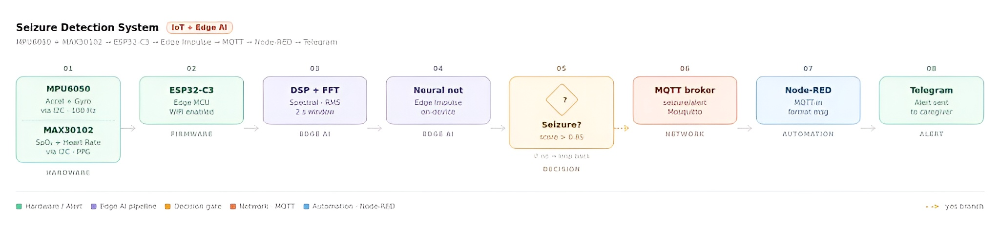

<h1 align="center">
  Seizure Detection and Caregiver Alert System Using TinyML
</h1>

<p align="center">

</p>

A learning-focused Edge AI project demonstrating how machine learning models can be trained with Edge Impulse, deployed on an ESP32-C3, and integrated into an IoT alerting pipeline.

## Problem Definition Identification

Modern IoT systems often rely on cloud-based processing, where sensor data is transmitted to remote servers for analysis. While effective, this approach can introduce latency, increase bandwidth consumption, and create dependency on continuous internet connectivity. With the rise of TinyML and edge computing, machine learning models can now run directly on low-power microcontrollers, enabling real-time decision making at the source of the data. This project was developed to explore the practical implementation of Edge AI in an IoT environment.

## Solution
 
We built a lightweight, wearable IoT device that detects seizures in real time using Edge AI — no cloud dependency, no delay.
The device continuously reads motion data from an MPU6050 sensor (accelerometer + gyroscope) amd heart rate sensor MAX30102 worn on the wrist or arm. A trained neural network runs entirely on the ESP32-C3 microcontroller, classifying every 2-second window of motion data as a seizure or normal activity. If the confidence score crosses **0.85**, the device immediately publishes an alert over MQTT, which Node-RED picks up and forwards as a **Telegram message to the caregiver**.
The result is an end-to-end pipeline — from body motion to caregiver notification — that works in seconds, runs offline for AI inference, and costs under $10 in hardware.



## Hardware
<div align="center">
  
| Component | Role | Key Specs |
|-----------|------|-----------|
| **ESP32-C3** | Main microcontroller | 32-bit RISC-V, WiFi, runs Edge Impulse model |
| **MPU6050** | Motion sensing | 3-axis accelerometer + 3-axis gyroscope, I2C, 100 Hz |
| **MAX30102** | Vital signs sensing | PPG-based SpO₂ + heart rate monitor, I2C |
| **LiPo Battery** | Power supply | 3.7V, wearable-friendly, rechargeable |
  
</div>

## AI Pipeline
The AI pipeline runs entirely on the ESP32-C3 — no cloud, no external server.
Sensor data from the MPU6050 and MAX30102 is sampled at **100 Hz** over a **2-second sliding window**. Each window is processed through a DSP block (FFT + RMS) to extract spectral and energy features, which are fed into a fully connected neural network trained on Edge Impulse Studio. The model — exported as a C++ library and flashed onto the device — classifies each window as `seizure` or `normal`. A confidence score above **0.85** triggers an alert; anything below loops back to the next window.

<p align="center">

</p>

## Architecture
 
The ESP32-C3 continuously collects motion and vital-sign data from the MPU6050 and MAX30102 sensors. An Edge Impulse model performs on-device inference and detects seizure events. When a seizure is detected, the ESP32 publishes an MQTT message to the broker. Node-RED subscribes to the MQTT topic and automatically forwards alerts to Telegram, enabling real-time caregiver notification.
 
```
ESP32-C3  →  MQTT Publish (seizure/alert)  →  Mosquitto Broker
                                                      ↓
                                             Node-RED (MQTT-in)
                                                      ↓
                                             Format Message
                                                      ↓
                                             Telegram Bot → Caregiver
```
 
### MQTT Topic
 
```
seizure/alert
```
 
### Example MQTT Payload
 
```json
{
  "device": "patient01",
  "seizure": true,
  "confidence": 0.94,
  "timestamp": "2026-06-03T12:45:00Z"
}
```
 
---
 
## Setup
 
### 1. Install Mosquitto MQTT Broker
 
**Ubuntu / Debian**
 
```bash
sudo apt update
sudo apt install mosquitto mosquitto-clients -y
sudo systemctl enable mosquitto
sudo systemctl start mosquitto
```
 
**Verify Installation**
 
```bash
sudo systemctl status mosquitto
```
 
**Test MQTT Subscriber**
 
```bash
mosquitto_sub -t seizure/alert
```
 
**Test MQTT Publisher**
 
```bash
mosquitto_pub -t seizure/alert -m '{"seizure":true}'
```
 
---
 
### 2. Install Node-RED
 
**Install Node.js and npm**
 
```bash
sudo apt update
sudo apt install nodejs npm -y
```
 
**Install Node-RED**
 
```bash
sudo npm install -g --unsafe-perm node-red
```
 
**Start Node-RED**
 
```bash
node-red
```
 
Open the editor at: `http://localhost:1880`
 
---
 
### 3. Install Telegram Nodes
 
Inside Node-RED:
 
1. Open the menu **(☰)**
2. Select **Manage Palette**
3. Click **Install**
4. Search for `node-red-contrib-telegrambot`
5. Click **Install**
---
 
### 4. Configure the Node-RED Flow
 
**Flow structure**
 
```
MQTT In  →  JSON  →  Switch (payload.seizure == true)  →  Function  →  Telegram Sender
```
 
**MQTT Configuration**
 
| Field | Value |
|-------|-------|
| Server | `localhost` |
| Port | `1883` |
| Topic | `seizure/alert` |
 
**Telegram Function Node**
 
```javascript
msg.payload = {
  chatId: "YOUR_CHAT_ID",
  type: "message",
  content: "🚨 Seizure Alert!\n" +
           "Patient requires immediate attention.\n" +
           "Confidence: " + (msg.payload.confidence * 100).toFixed(1) + "%"
};
return msg;
```
 
> Replace `YOUR_CHAT_ID` with your actual Telegram chat ID.
 
---
 
### 5. Import a Prebuilt Flow
 
If the repository includes a prebuilt flow at `flows/seizure_alert_flow.json`:
 
1. Open Node-RED
2. Click **Menu → Import**
3. Select `flows/seizure_alert_flow.json`
4. Configure MQTT settings
5. Configure the Telegram Bot Token
6. Click **Deploy**
---
 
## Running the System
 
```bash
# Start MQTT broker
sudo systemctl start mosquitto
 
# Start Node-RED
node-red
 
# Monitor incoming MQTT messages
mosquitto_sub -t seizure/alert
```
 
Open Node-RED at `http://localhost:1880`.
 
When the Edge Impulse model detects a seizure event, the ESP32-C3 publishes an MQTT alert. Node-RED receives the message and instantly sends a Telegram notification to the configured caregiver or emergency contact.
 